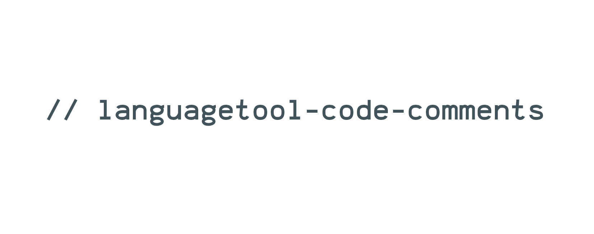

[](https://github.com/dustinblackman/languagetool-code-comments/actions)
[](https://github.com/dustinblackman/languagetool-code-comments/releases)
[](https://coveralls.io/github/dustinblackman/languagetool-code-comments?branch=master)

> `languagetool-code-comments` integrates the LanguageTool API to parse, spell check, and correct the grammar of your code comments!

- [Overview](#Overview)
- [Install](#Install)
  - [MacOS](#macos)
  - [Debian / Ubuntu](#debian--ubuntu)
  - [Nix](#nix)
  - [Arch Linux](#arch-linux)
  - [Windows](#windows)
  - [Manual](#manual)
  - [Source](#source)
- [Usage](#Usage)
  - [CLI](#cli)
  - [Neovim](#neovim)
  - [Visual Studio Code](#visual-studio-code)
- [Development](#Development)
  - [Setup](#setup)
  - [Adding a new language](#adding-a-new-language)

## Overview

Never will you submit a PR where you fat-fingered `// This is a hck` in your code again. LTCC can be integrated directly in your editor, or used in a linting fashion in your CI pipelines. Caching is built in to speed up processing new and edited docs.

Using the power of [Tree Sitter](https://tree-sitter.github.io/tree-sitter/#available-parsers), LTCC easily integrates with several programming languages. And if privacy is a concern, and you have some spare hardware lying around, LanguageTool offers a [great way](https://dev.languagetool.org/http-server) to self-host your own instance.

<!-- command-help start -->

```
languagetool-code-comments 0.1.0
Integrates the LanguageTool API to parse, spell check, and correct the grammar of your code
comments!

USAGE:
    languagetool-code-comments <SUBCOMMAND>

OPTIONS:
    -h, --help       Print help information
    -V, --version    Print version information

SUBCOMMANDS:
    cache         Functionality around the LanguageTools result cache.
    check         Parses source code comments from the provided file and passes them to
                      LanguageTool, returning grammar and spelling mistakes if any.
    completion    Generates shell completions
    help          Print this message or the help of the given subcommand(s)

SUPPORTED LANGUAGES:
  - bash
  - go
  - hcl
  - javascript
  - jsx
  - python
  - rust
  - tsx
  - typescript
```

<!-- command-help end -->

## Install

### MacOS

```sh
brew install dustinblackman/tab/languagetool-code-comments
```

### Debian / Ubuntu

```sh
curl -s https://dustinblackman.github.io/apt/deb/KEY.gpg | apt-key add -
curl -s https://dustinblackman.github.io/apt/deb/dustinblackman.list > /etc/apt/sources.list.d/dustinblackman.list
```

### Nix

```sh
nix-env -f '<nixpkgs>' -iA nur.repos.dustinblackman.languagetool-code-comments
```

### Arch Linux

```sh
yay -S languagetool-code-comments-bin
```

### Windows

```sh
scoop bucket add dustinblackman https://github.com/dustinblackman/scoop-bucket.git
scoop install languagetool-code-comments
```

### Manual

Download the pre-compiled binaries and packages from the [releases page](https://github.com/dustinblackman/languagetool-code-comments/releases) and
copy to the desired location.

### Source

```sh
git clone https://github.com/dustinblackman/languagetool-code-comments.git
cd languagetool-code-comments
git submodule update --init --recursive
cargo install --path .
```

## Usage

### CLI

```sh
languagetool-code-comments check -l en-US --file /home/me/my-test-file.rs
```

### Neovim

See [./tools/null-ls-config.lua](./tools/null-ls-config.lua)

The above uses [`null-ls`](https://github.com/jose-elias-alvarez/null-ls.nvim), and is based off the soon-to-be
[`ltrs`](https://github.com/jose-elias-alvarez/null-ls.nvim/pull/997) configuration. Once I feel `languagetool-code-comments` responses have stabilized, I'll attempt PRing the configs to `null-rs` itself.

### Visual Studio Code

Coming Soon! Follow https://github.com/dustinblackman/languagetool-code-comments/issues/1 for updates.

## Development

### Setup

```sh
git clone https://github.com/dustinblackman/languagetool-code-comments.git
cd languagetool-code-comments
git submodule update --init --recursive
cargo check
```

### Adding a new language

Let's take the following steps to add Perl to `languagetool-code-comments`, as example which will take you from selecting the Tree
Sitter config, to integrating the language in the repo, writing tests, and QAing. If you'd like to check out a complete example,
see [add HCL](https://github.com/dustinblackman/languagetool-code-comments/commit/4bbba4ceba9553a64a8c921afc61fc014987354a).

1. Follow the [setup](#setup) for the project.
2. Head over to the [Tree Sitter Parsers](https://tree-sitter.github.io/tree-sitter/#available-parsers) docs and select the Perl parser.
3. Add the repo as a submodule with `git submodule add https://github.com/ganezdragon/tree-sitter-perl ./external/tree-sitter-perl`
4. Update [`build.rs`](./build.rs) by adding a configuration for Perl in the `langs` vec. Perl includes both a `parser.c` and `scanner.cc`, so the configuration would look like the following.

```rust
build_treesitter_grammar(
    "tree-sitter-perl",
    "tree-sitter-perl/src",
    vec!["parser.c", "scanner.cc"],
),
```

5. Run `cargo build` to verify the configuration is set up correctly.
6. Update [`parse.rs`](./src/parse.rs) by adding `fn tree_sitter_perl() - Language;` to `extern "C"`.
7. Update the `get_parser()` function in [parse.rs](./src/parse.rs) to match the Perl file extension.
8. Create a Perl file fixture in `./tests/fixtures`, following the examples of the other languages.
9. Update [`parse_test.rs`](./src/parse_test.rs) with a test for Perl, following the examples of the other languages.
10. Run `cargo test` to prove your tests work.
11. Run `cargo build` and test the CLI works as expected with Perl.
